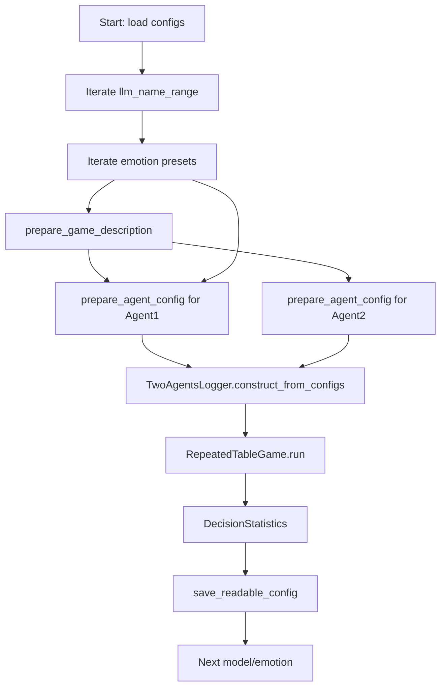

# EAI: Emotional Decision-Making in LLMs for Strategic Games and Ethical Dilemmas
### Fork From https://github.com/AIRI-Institute/EAI-Framework
This repository hosts the EAI framework for studying how large language models (LLMs) behave in strategic games when guided by explicit emotional instructions. The current codebase focuses on running reproducible experiments for repeated table games (e.g., Prisoner's Dilemma) and division games (Dictator and Ultimatum), logging decisions, and analyzing outcomes.

## Overview
- **Emotion-aware prompting**: Injects emotion cues into prompts and tracks emotion reflections across rounds.
- **AWS Bedrock integration**: Uses the Converse API to run a range of foundation models via `boto3`, including automatic handling of models that do not support system prompts.
- **Robust game loops**: Improved parsing of LLM outputs for moves and split proposals, with graceful fallbacks to prevent run crashes.
- **Post-run analytics**: Scripts to summarize cooperation rates in table games and proposer/responder behavior in division games.

## Recent Updates
- Added two executable entry points: `run_table_game.py` for repeated table games and `run_exps_division_game.py` for division-game experiment sweeps.
- Refactored experiment loops to simplify configuration, reduce parameter grids, and harden parsing of model outputs.
- Integrated centralized AWS Bedrock client initialization with environment-variable credentials and fallback warnings.
- Expanded log analyzers to read consolidated configs (`config.json`) and guard against malformed or empty CSV files.

## Project Structure
```
.
├── README.md
├── requirements.txt
├── analyze_division_game.py
├── analyze_table_game.py
├── run_exps_division_game.py
├── run_table_game.py
├── prompts/
│   └── {language}/
│       ├── agent/
│       ├── emotions/
│       └── games/
└── src/
    ├── agent/
    ├── config_utils/
    ├── division_game.py
    ├── game.py
    ├── utils.py
    └── ...
```

## Installation
### Prerequisites
- Python 3.9 or higher
- AWS credentials with Bedrock Runtime access (see **Configuration**)

### Setup
1. Clone the repository and enter the project directory:
   ```bash
   git clone https://github.com/your-username/your-repo-name.git
   cd your-repo-name
   ```
2. (Optional) Create and activate a virtual environment:
   ```bash
   python -m venv .venv
   source .venv/bin/activate  # On Windows use: .venv\Scripts\activate
   ```
3. Install dependencies:
   ```bash
   pip install -r requirements.txt
   ```

### Configuration
- Set AWS credentials as environment variables before running experiments:
  ```bash
  export AWS_ACCESS_KEY_ID="<your-access-key>"
  export AWS_SECRET_ACCESS_KEY="<your-secret-key>"
  export AWS_REGION="us-east-1"  # override if needed
  ```
- Prompts default to the English set. Update `LANGUAGE` in `src/dirs.py` if you need another language folder under `prompts/`.

## Usage
### Repeated Table Game Experiments
Runs Prisoner's Dilemma rounds across a list of Bedrock models and emotion settings.
```bash
python run_table_game.py
```
Key behaviors:
- Iterates over `llm_name_range` and the emotion presets in `experiments`.
- Generates prompts from `prompts/{language}/games/prisoner_dilemma` and writes logs to `logs/<timestamped_run>`.
- Produces cooperation statistics via `DecisionStatistics` and saves readable summaries next to the logs.

### Division Game Experiment Sweep
Runs Dictator and Ultimatum experiments with reduced grids for representative sampling.
```bash
python run_exps_division_game.py
```
Key behaviors:
- Samples a constrained set of totals, coplayer names, emotion prompts, and model IDs defined near the top of the script.
- Supports both proposer (Dictator/Ultimatum step 1) and responder (Ultimatum step 2) roles.
- Logs are written under `logs/` with per-run configs for reproducibility.

### Log Analysis
Summaries can be generated after runs:
```bash
python analyze_table_game.py logs
python analyze_division_game.py logs
```
- `analyze_table_game.py` computes cooperation rates per model/emotion for Prisoner's Dilemma runs.
- `analyze_division_game.py` reports proposer kept-share percentages and responder accept rates.

## Prompt Layout
Prompts are organized under `prompts/{language}`:
- `agent/` contains memory update templates, emotion questions, and round prompts.
- `games/` contains reward matrices and rule descriptions for each game.
- `emotions/` provides emotion-specific inserts used when `has_emotion=True`.

## Contributing
Contributions are welcome! Please open an issue or pull request describing the change you propose.

## Developer Guide
### `run_table_game.py`
**Execution flow**
1. Define baseline configs for the Prisoner's Dilemma game, naming conventions, and agent templates.
2. Loop over the configured `llm_name_range`; for each model, loop over the emotion presets in `experiments`.
3. Build per-run game and agent configs using `prepare_game_description` and `prepare_agent_config`, forcing the selected emotion back onto the agent config to avoid loss during templating.
4. Initialize `TwoAgentsLogger` with a model-specific suffix and execute `RepeatedTableGame.run`, which parses moves robustly, logs scratchpads, and updates emotion memories.
5. Compute cooperation statistics via `DecisionStatistics` and save a human-readable summary to the log directory.

**Dependencies**
- `src.config_utils.table_utils.prepare_game_description`
- `src.config_utils.table_utils.prepare_agent_config`
- `src.game.RepeatedTableGame`
- `src.agent.init_agent`
- `src.utils.TwoAgentsLogger`, `save_readable_config`
- `src.evaluation.DecisionStatistics`

**Flowchart**


### `run_exps_division_game.py`
**Execution flow**
1. Define reduced experiment grids for totals, coplayer names, models, emotions, and scratchpad usage.
2. Generate proposer and responder agent configs (including predefined ratio agents for Ultimatum step 2).
3. For each Dictator/Ultimatum configuration, build prompts via `prepare_division_game_config` and `prepare_agent_config`.
4. Instantiate `DivisionGame` with role-specific parameters and run it through `run_pipeline`, which sets up logging and executes the game.
5. Persist configs and decisions to `logs/` for later aggregation; optional cached config handling is stubbed out.

**Dependencies**
- `src.config_utils.division_utils.prepare_division_game_config`
- `src.config_utils.division_utils.prepare_agent_config`
- `src.division_game.DivisionGame`
- `src.agent.init_agent`
- `src.utils.TwoAgentsLogger`, `save_readable_config`, `print_config`

**Flowchart**
```mermaid
flowchart TD
    Start[Start: define grids] --> GenGames[generate_game_configs]
    Start --> GenAgents[generate_agent_configs + predefined ratios]
    GenGames --> LoopGames[Loop game configs]
    GenAgents --> LoopGames
    LoopGames --> Build[prepare_division_game_config]
    Build --> Agent1[prepare_agent_config (agent1)]
    Build --> Agent2[prepare_agent_config (agent2)]
    Agent1 --> Pipeline[run_pipeline]
    Agent2 --> Pipeline
    Pipeline --> Play[DivisionGame.run via run_game]
    Play --> Log[TwoAgentsLogger + save_readable_config]
    Log --> Next[Next configuration]
```
